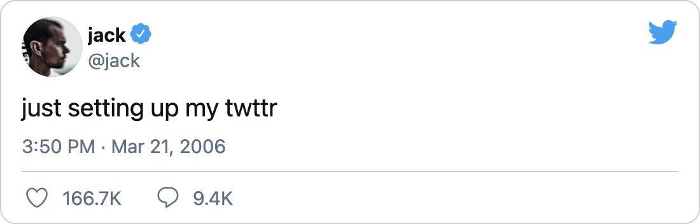
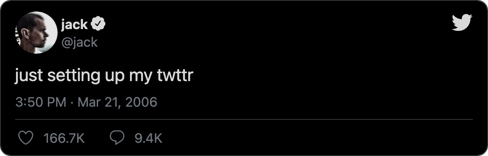
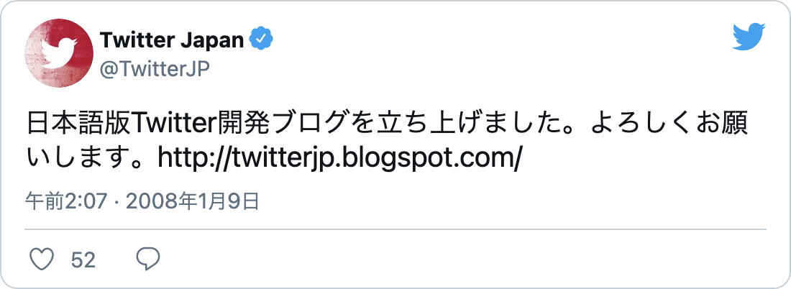

# 📸 snap-tweet <a href="https://npm.im/snap-tweet"></a> <a href="https://packagephobia.now.sh/result?p=snap-tweet"></a>

Command-line tool to capture clean and simple tweet snapshots.

<p align="center">
  <a href="https://twitter.com/jack/status/20">
    
  </a>
  <br>
  <em>Light mode</em>
</p>

<p align="center">
  <a href="https://twitter.com/jack/status/20">
    
  </a>
  <br>
  <em>Dark mode</em>
</p>

### Features
- 🎛 Adjustable width
- 💅 Rounded corners & transparent background
- 🌚 Dark mode
- 🌐 Customizable locale
- 🙅‍♀️ No "Share" & "Info" buttons
- 💖 No watermark
- 🔥 Snap multiple tweets at once

<sub>Support this project by ⭐️ starring and sharing it. [Follow me](https://github.com/privatenumber) to see what other cool projects I'm working on! ❤️</sub>

## 🚀 Install
The only requirement is to have [Google Chrome Browser](https://www.google.com/chrome/).


```sh
npm i -g snap-tweet
```

### npx
Use [npx](https://nodejs.dev/learn/the-npx-nodejs-package-runner) to run without installation.
```sh
npx snap-tweet
```

## 🚦 Quick usage
### Basic usage
By default, the tweet snap is opened in your default image viewer so you can decide whether to save or not.
```sh
snap-tweet https://twitter.com/jack/status/20
```

### Save to directory
Save the tweet snap to a specified directory using the `--output-dir` flag.
```sh
snap-tweet https://twitter.com/jack/status/20 --output-dir ~/Desktop
```

### Dark mode
Snap a tweet in dark mode using the `--dark-mode` flag.
```sh
snap-tweet https://twitter.com/jack/status/20 --dark-mode
```

### Custom width
Pass in a custom width for the tweet using the `--width` flag.
```sh
snap-tweet https://twitter.com/github/status/1390807474748416006 --width 900
```

<p align="center">
  <a href="https://twitter.com/github/status/1390807474748416006">
    
  </a>
  <br>
  <em>Tweet with a 900px width</em>
</p>

### Localization
Pass in a [different locale](https://developer.twitter.com/en/docs/twitter-for-websites/supported-languages) using the `--locale` flag.
```sh
snap-tweet https://twitter.com/TwitterJP/status/578707432 --locale ja
```

<p align="center">
  <a href="https://twitter.com/TwitterJP/status/578707432">
    
  </a>
  <br>
  <em>Using the Japanese locale (ja)</em>
</p>

### Show Thread
Use the `--show-thread` flag to include the parent tweet in the screenshot.

```sh
snap-tweet https://twitter.com/jack/status/1108487919969275904 --show-thread
```

<p align="center">
  <a href="https://twitter.com/jack/status/1108487919969275904">
    
  </a>
  <br>
  <em>Parent tweet inlcuded in the screenshot</em>
</p>

### Multiple tweets
Snap multiple tweets at once by passing in multiple tweet URLs.
```sh
snap-tweet https://twitter.com/naval/status/1002103497725173760 https://twitter.com/naval/status/1002103559276478464 https://twitter.com/naval/status/1002103627387813888
```

### Manual
```
snap-tweet

Usage:
  $ snap-tweet <...tweet urls>

Options:
  -d, --dark-mode                       Show tweet in dark mode
  -c, --fill-comment-button             Fill the comment button
  -l, --fill-like-button                Fill the like button
  -h, --help                            Show help
  -b, --hide-follow-button              Hide the follow button
      --locale <locale>                 Locale (default: "en")
  -o, --output-dir <path>               Tweet screenshot output directory
  -f, --output-filename <string>        Tweet screenshot output filename
  -x, --scale <number>                  Scale of tweet (multiplier to increase the resolution)     
                                        (default: 1)
  -s, --show-comments                   Show comments
  -t, --show-thread                     Show tweet thread
      --version                         Show version
  -w, --width <width>                   Width of tweet (default: 550)

## 🏋️‍♀️ Motivation
It all started when I simply wanted to embed a couple tweets into a Google Doc...

Quick googling showed that there's no way to embed an actual tweet because Google Docs  doesn't support HTML iframes or JavaScript. And I wasn't going to install a plugin just for some tweets.


I figured I could just take a screenshot of the tweet. But only to realize I would be spending way too much time cropping each tweet, and they still wouldn't be perfect because of the lack of transparency behind the rounded corners. And not to mention, the static screenshot would include buttons like "Copy link to Tweet" that looked actionable but actually weren't.

I found services like [Screenshot Guru](https://screenshot.guru) (and their [Twitter Screenshots](https://chrome.google.com/webstore/detail/twitter-screenshots/imfhndkgmnbnogfjcecdpopaooachgco) Chrome extension), [Pikaso](https://pikaso.me/), etc. but none of them met my needs (low quality images, actionable buttons present, watermarks, etc.).

All I wanted to do was to embed the tweet like how it looks in the [official embedder](https://publish.twitter.com/#) into a static environment. No sign up, no watermark, no BS... It shouldn't be this hard! 🤯

So of course, I spent a few hours developing a tool to save us all the headache 😇

_(I know, this is some pretty crazy [yak shaving](https://en.wiktionary.org/wiki/yak_shaving). Checkout [my other projects](https://github.com/privatenumber) to see how deep I've gone.)_

## 🙋‍♀️ Need help?
If you have a question about usage, [ask on Discussions](https://github.com/privatenumber/snap-tweet/discussions).

If you'd like to make a feature request or file a bug report, [open an Issue](https://github.com/privatenumber/snap-tweet/issues).
